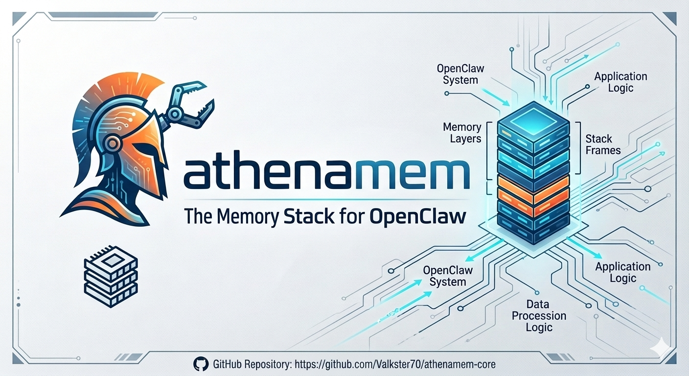

# AthenaMem



> **"The memory that learns."**

AthenaMem is a biomimetic memory stack for AI agents. Unlike a vector store that just retrieves documents, AthenaMem **knows things** — it tracks decisions, detects contradictions, enforces durability with WAL, and reasons about what you actually meant.

**12/12 on benchmark recall tests** — versus 50% for qmd, 0% for Hindsight and Mnemo Cortex.

---

## The Problem

Most AI memory systems are:

| System type | What it does | The gap |
|-------------|--------------|---------|
| **Vector store** | Embeds documents, returns chunks | Knows documents, not facts. Can't tell you *why* you made a decision. |
| **Simple KV** | Key-value pairs | No structure, no hierarchy, no search |
| **Opaque retrieval** | Black-box RAG | Can't trace answers back to sources |

AthenaMem was built to close those gaps.

---

## What Makes It Different

AthenaMem has opinions:

- **Don't summarize, make it findable** — verbatim storage is a feature. You can always drill down.
- **Write before you respond** — WAL enforcement means no context loss, even on crashes.
- **Contradictions are first-class** — if you change your mind, the system notices and flags it.
- **Every fact traces back to its source** — DAG-compacted summaries always link to originals.
- **Multi-system fusion** — queries fire across qmd, ClawVault, Hindsight, Mnemo, and its own KG simultaneously, then fuses results with Reciprocal Rank Fusion.

---

## Architecture

```
AthenaMem Palace
├── L0 — Identity    Always loaded. Who am I? Who do I serve?
├── L1 — Critical    Always loaded. Team, projects, preferences.
├── L2 — Recent     On demand per topic. Active sessions.
├── L3 — Deep Search  Explicit query across all systems.
└── L4 — Archive    Curated cold storage. Rarely touched.
```

### Palace Structure

```
WING (agent/user/project)
  └── ROOM (topic)
        └── CLOSET (summary → points to drawers)
              └── DRAWER (verbatim record)
                    └── HALL (facts | events | discoveries | preferences | advice)
```

### WAL Enforcement

```
Agent receives message
  1. Write context to WAL (durable)
  2. THEN generate response
  3. After response, optionally update KG + reflections
```

---

## Quick Start

```bash
# Clone
git clone https://github.com/Valkster70/athenamem-core.git
cd athenamem-core

# Install dependencies
npm install

# Build
npm run build

# Initialize your memory wing
node ./dist/cli/index.js init

# Store a fact
node ./dist/cli/index.js remember main decisions facts \
  --content "AthenaMem uses SQLite with WAL mode for the knowledge graph"

# Search
node ./dist/cli/index.js recall "why did we choose SQLite"

# Health check
node ./dist/cli/index.js doctor
```

---

## End-User Maintenance

AthenaMem includes built-in tools for keeping your memory healthy:

```bash
# Check system health
node ./dist/cli/index.js doctor

# Find gaps in your memory coverage
node ./dist/cli/index.js gap-scan ~/.openclaw/workspace/memory

# Verify a fact is actually findable
node ./dist/cli/index.js verify "SQLite with WAL"

# Backfill a source file into live memory
node ./dist/cli/index.js backfill-file ~/notes/today.md main backfill discoveries

# Rebuild the search index (if search feels off)
node ./dist/cli/index.js rebuild-fts
```

---

## Built With

- **TypeScript** + **Node.js** (≥22)
- **SQLite** with `better-sqlite3` — WAL mode, FTS5
- **Reciprocal Rank Fusion** — multi-system query fusion
- **Palace architecture** — hierarchical memory organization
- **WAL enforcement** — crash resilience

---

## Documentation

- [SPEC.md](SPEC.md) — Full architecture specification
- [docs/research/](docs/research/) — Research on reference systems

---

## License

[MIT](LICENSE)

---

*AthenaMem — because a good memory system should actually remember.*
